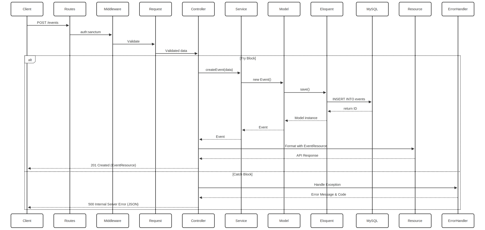
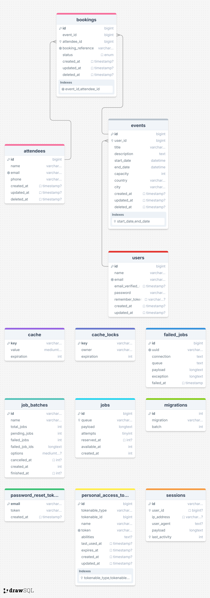

## ✅ 1. Project Structure

```
event-api/
├── app/
│   ├── Http/
│   │   ├── Controllers/
│   │   │   └── BookingController.php
│   │   │   └── ... (Other Controller files)
│   │   └── Requests/
│   │   │   ├── StoreBookingRequest.php
│   │   │   └── UpdateBookingRequest.php
│   │   │   └── ... (Other Reuest files)
│   │   └── Requests/
│   │       ├── BookingResource.php
│   │       └── BookingResource.php
│   │   │   └── ... (Other Resources files)
│   ├── Models/
│   │   ├── Booking.php
│   │   ├── Event.php
│   │   └── Attendee.php
│   │   └── User.php
│   └── Services/
│       └── BookingService.php
├── docker/
│   └── php/
│   │   └── Dockerfile
│   └── nginx/
│       └── default.conf
├── docker-compose.yml
├── database/
│   └── migrations/
│   └── factories/
├── routes/
│   └── api.php
├── resources/
│   └── views/
├── app/Http/Resources/
│   ├── BookingResource.php
│   └── BookingCollection.php
├── .env
├── composer.json
├── artisan
└── ... (Other Laravel files)
```

---

## ✅ 5. Laravel `.env` Configuration

Copy `.env.example` and save as `.env`
```bash
cp .env.example .env
```

Update your `.env`:

```env
APP_NAME=event_api_laravel_app
APP_ENV=local
APP_KEY=
APP_DEBUG=true
APP_URL=http://localhost

DB_CONNECTION=mysql
DB_HOST=mysql
DB_PORT=3306
DB_DATABASE=csv_db
DB_USERNAME=csv_user
DB_PASSWORD=csv_pass
```

---

## ✅ 6. Build & Run Everything

```bash
docker-compose up -d --build
```

---

## ✅ 7. Laravel Setup (inside container)

On Host system, command line:

```bash
sudo chown -R $USER:$USER .
docker exec -it event_api_laravel_app bash
```

Once containers are up, open a shell inside the app container:

Run:

```bash
composer install
php artisan key:generate
php artisan migrate
```

Run Tests:

```bash
php artisan test
```

Now event api is available at:
👉 http://localhost:9001/api

## Flowchart Diagram


---
## Sequence Diagram


## Database Schema


## Postman Collection:
[Download Event Booking System API Postmand Collection](https://raw.githubusercontent.com/kinjalgiri/event-api/refs/heads/main/Event%20Booking%20System%20API.postman_collection.json)

## What's included:

1. **Database Design**:
   - Appropriate indexes and constraints
   - Relationship management

2. **Application Architecture**:
   - MVC pattern
   - Repository pattern (could be extended)
   - Service layer for business logic
   - DTOs for request/response formatting

3. **Validation**:
   - Form request validation
   - Business rule validation (capacity, duplicates)
   - Database transaction management

4. **Error Handling**:
   - Consistent error responses
   - Proper HTTP status codes
   - Exception handling

5. **Testing**:
   - Unit tests for service
   - Feature tests for API endpoints

6. **Security**:
   - Input validation
   - Authentication ready (Sanctum)
---
